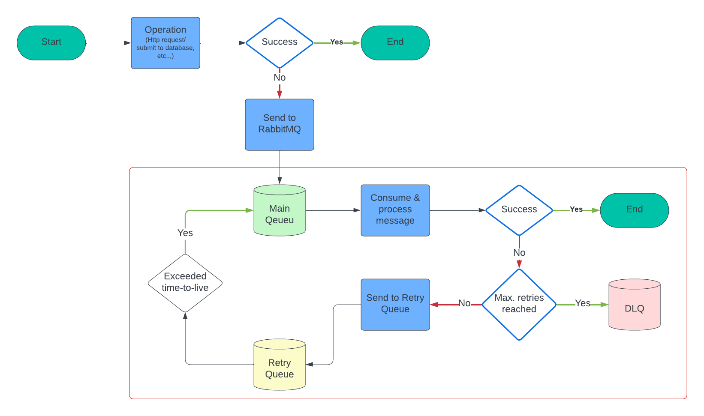

# Retryable RabbitMQ

Handling retry mechanisms in RabbitMQ was traditionally challenging. However, with
`retryable-rabbitmq`, it becomes remarkably straightforward. By seamlessly integrating this
library into your project, you empower your applications with robust and reliable message processing
capabilities without the hassle of complex setup procedures.



## Installation and Configuration

### 1. Add dependency

Ensure seamless integration by including the library as a dependency in your `pom.xml`:

```xml

<dependency>
    <groupId>org.optimal.apps</groupId>
    <artifactId>retryable-rabbitmq</artifactId>
    <version>1.0.0</version> <!-- Replace with the latest version -->
</dependency>
```

### 2. Enable Autoconfiguration

To enable the library within your Spring Boot project, follow these steps:

1. Add `@EnableRetryableRabbitMQ` to your configuration class.
2. Implement the `RetryableRabbitMQProperties` interface to pick up RabbitMQ properties from
   your `application.yml` or `application.properties` file or manually set up the properties.

Here's an example:

```java

@Configuration
@EnableRetryableRabbitMQ
@ConfigurationProperties("application.retryable")
public class RetryableRabbitMQConfiguration implements RetryableRabbitMQProperties {

    Map<String, RabbitQueueConfig> rabbitmq = new HashMap<>();

    @Override
    public Map<String, RabbitQueueConfig> getRabbitmq() {
        return this.rabbitmq;
    }

    @Override
    public void setRabbitmq(Map<String, RabbitQueueConfigImpl> rabbitmqImpl) {
        this.rabbitmq = new HashMap<>();
        this.rabbitmq.putAll(rabbitmqImpl);
    }
}
```

## Usage

The library simplifies RabbitMQ integration through `@RetryableRabbitHandler`, a drop-in replacement
for `@RabbitHandler`. It effortlessly manages the entire retry mechanism for you.

Moreover, you **DON'T** need to define RabbitMQ queues, exchanges, and bindings manually. The
library automates these tasks based on your `application.yml` properties.

```yaml
application:
  retryable:
    rabbitmq:
      create-items:
        exchange-name: item
        queue-name: item-create-command-queue
        routing-key: item.create.command
        arguments:
          x-dead-letter-exchange: ${application.retryable.rabbitmq.create-items.exchange-name}
          x-dead-letter-routing-key: ${application.retryable.rabbitmq.create-items.routing-key}.retry
          x-single-active-consumer: true

        retry-queue-arguments:
          x-dead-letter-exchange: ${application.retryable.rabbitmq.create-items.exchange-name}
          x-dead-letter-routing-key: ${application.retryable.rabbitmq.create-items.routing-key}
          x-single-active-consumer: true
          x-message-ttl: 600000 // 10 minutes
```

#### Examples:

```java

@Component
@RabbitListener(queues = "item-create-command-queue")
public class CustomListener {

    // Example 1: Simple handler
    @RetryableRabbitHandler
    protected void handle(Message message) {
        // Your implementation without handling exceptions.
    }

    // Example 2: Handler with a payload
    @RetryableRabbitHandler
    protected void anotherHandler(Message message, @Paylaod Item item) {
        // Your implementation without handling exceptions.
    }

    // Example 3: Handler with headers
    @RetryableRabbitHandler
    protected void anotherHandler(Message message, @Headers Map<String, Object> headers) {
        // Your implementation without handling exceptions.
    }

    // Example 4: Handler + maxAttempts argument
    @RetryableRabbitHandler(maxAttempts = 5)
    protected void anotherHandler(Message message, @Headers Map<String, Object> headers) {
        // Your implementation without handling exceptions.
    }

    // Example 5: Handler + retryFor and noRetryFor arguments
    @RetryableRabbitHandler(retryFor = {TimeoutException.class}, noRetryFor = {
        IllegalArgumentException.class})
    protected void anotherHandler(Message message, @Headers Map<String, Object> headers) {
        // Your implementation without handling exceptions.
    }
}
```

### Customizing Retry Logic

You have the flexibility to tailor when to retry by extending
`de.xchange.retryable.rabbitmq.policy.RetryPolicy` and overriding the `shouldRetry` method. Below is
a template demonstrating how you can achieve this:

```java

import org.springframework.amqp.core.Message;

@Component
public class CustomRetryPolicy implements RetryPolicy {

    @Override
    public boolean shouldRetry(RetryableRabbitHandler annotation, Message message, Throwable exception) {
        if (message.getMessageProperties().getReceivedRoutingKey().equals("item.update")) {
            return message.getBody().length < 1000; // Custom retry logic
        }

        return true;
    }
}
```

_Note: The `CustomRetryPolicy` will be applied globally to all `@RetryableRabbitHandler` methods._